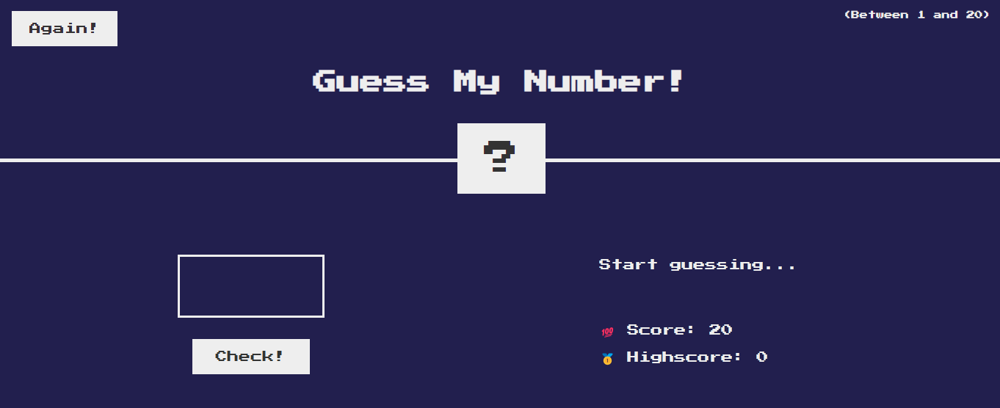

# Number Guessing Game

 

    <a href="https://guessmynumber-ester.netlify.app/">View Demo</a>
  

  
## Preview

## Description

This is a simple number guessing game built using **JavaScript**, **HTML**, and **CSS**. The game generates a random secret number between 1 and 20, and the player has to guess the number. After each guess, the game provides feedback in the form of a message, indicating whether the guess is too high or too low. The player has a limited number of attempts (20) to guess the correct number. If the player guesses the correct number, they win; if they run out of attempts, they lose.

## How to Play

1. Open the HTML file in a web browser.
2. Enter a number between 1 and 20 in the input field.
3. Click the "Check" button to submit your guess.
4. Read the feedback message to adjust your next guess.
5. Keep guessing until you win or run out of attempts.
6. To play again, click the "Again" button.

## Code Structure

The code is organized into the following sections:

- **Variable declarations**: `secretNumber`, `score`, and `highscore` are declared at the top of the file.
- **displayMessage function**: A helper function to update the message element with a given message.
- **Event listeners**: Two event listeners are attached to the "Check" and "Again" buttons.
- **Game logic**: The game logic is implemented in the event listener functions, which handle user input, update the game state, and provide feedback to the user.

## Features

- Random secret number generation
- Limited number of attempts (20)
- Feedback messages for correct, too high, and too low guesses
- Winning and losing conditions
- Game reset functionality

## **Contributing**

If you'd like to contribute to this application, please fork the repository and submit a pull request.
